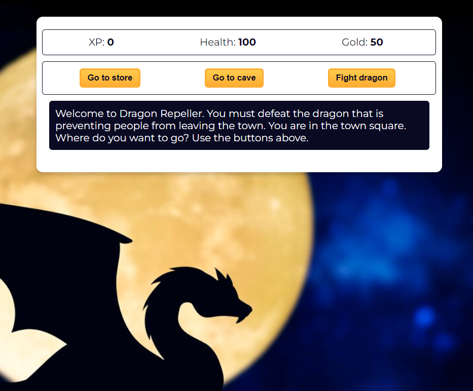

# Dragon Repeller Game

## Introduction
Welcome to Dragon Repeller, an exciting text-based adventure game where you fight monsters, collect gold, and strive to defeat the dragon! Begin your journey in the town square, gear up at the store, brave the dangers of the cave, and ultimately face the dragon in a thrilling battle. Good luck, adventurer!

## Gameplay Mechanics

### Starting Stats
- **Experience (XP):** 0
- **Health:** 100
- **Gold:** 50
- **Current Weapon:** Stick
- **Inventory:** Stick

### Locations
- Town Square
- Store
- Cave
- Fight Scene
- Victory or Defeat Scenes
- Secret Easter Egg Game

### Monsters
- Slime (Level 2)
- Fanged Beast (Level 8)
- Dragon (Level 20)

### Weapons
- Stick (Power 5)
- Dagger (Power 30)
- Claw Hammer (Power 50)
- Sword (Power 100)

### Game Functions
- Explore different locations
- Fight various monsters
- Buy health and weapons
- Manage inventory
- Attack, dodge, or run from monsters
- Easter Egg mini-game for extra rewards

### Gameplay Loop
1. Start at the town square.
2. Choose to visit the store, cave, or fight the dragon.
3. Buy health or weapons at the store.
4. Fight monsters in the cave.
5. Return to town square to heal and upgrade.
6. Defeat the dragon to win the game!

### Losing the Game
If your health reaches 0, you lose the game. You can choose to replay from the beginning.

### Winning the Game
Defeat the dragon to win the game and celebrate your victory!

## How to Play
- Use the on-screen buttons to make choices and interact with the game world.
- Monitor your health, gold, and XP to strategize your next moves.
- Choose wisely in battles to defeat monsters and progress in the game.

### Easter Egg Mini-Game
- A secret mini-game where you can win extra gold. Guess the right number to win!

### Restarting the Game
- You can restart the game at any point to try a different strategy.

## Developer Notes
- The game is built using JavaScript and HTML for an interactive gaming experience.
- It's designed for casual gameplay and accessible to players of all ages.

## Credits
- Game Design and Development: [FreecodeCamp & Jaroslav Krbec]
- Graphics and Artwork: [Jaroslav Krbec]
- Special Thanks: [Freecodecamp.org]

---

Enjoy playing Dragon Repeller and embark on your adventure to defeat the mighty dragon!

